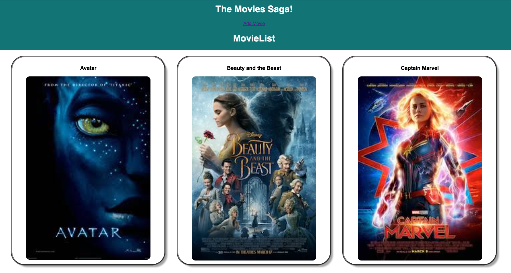
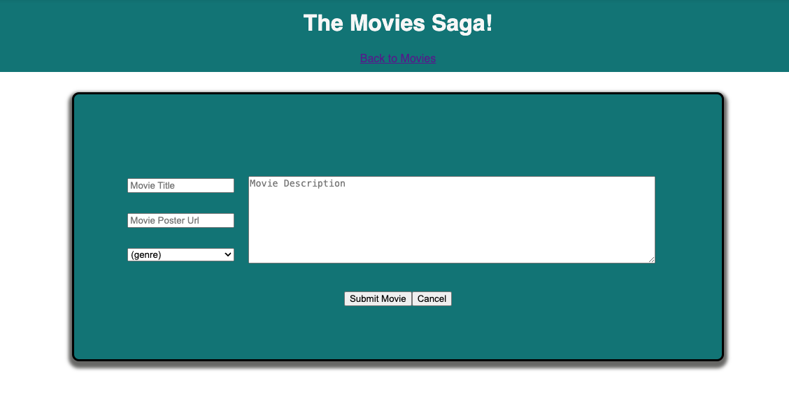

# Movie List

A website that shows a list of movies with details that can be viewed.

## Setup

If you want to create a copy of this code and get it working on your computer, you will need to `npm install`, `npm run server`, and `npm run client`.

You will also need to setup a database called 'saga_movies_weekend' or you can change it to whatever you want by going to `/server/modules/pool.js on line 21` as well as copy, paste and run the code in the database.sql file into your database.

## Description

The home page shows a list of available movies
- Upon clicking on a movie poster the user will be taken to the details view for that movie.
- Clicking the 'Add Movie' link will take the user to the AddMovie view.

- The details page has the movie title, the poster, a brief description of the movie, and each of the genres the movie falls under.

- The add movie page allows the user to add a new movie to the database where it can be displayed on the movie list page.

